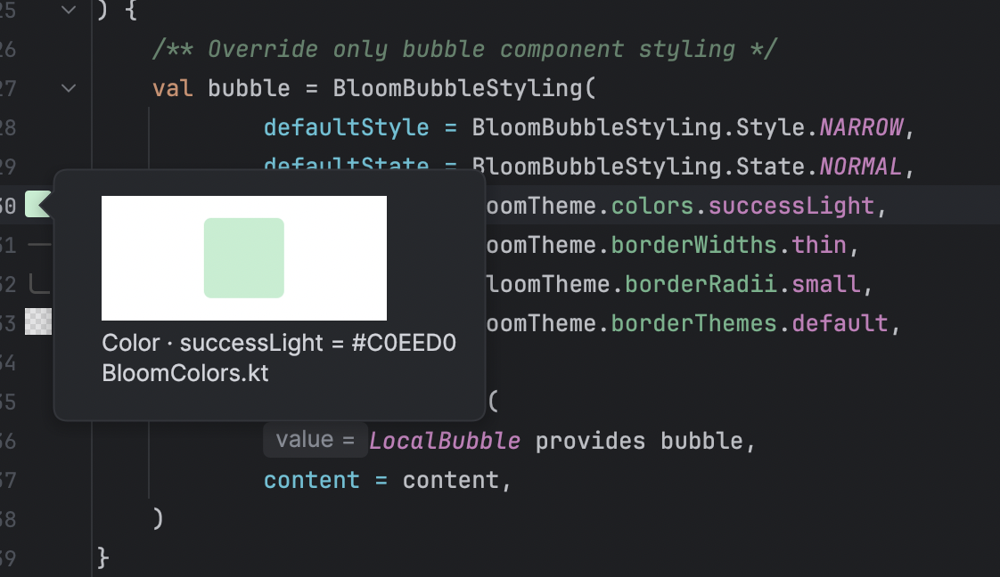
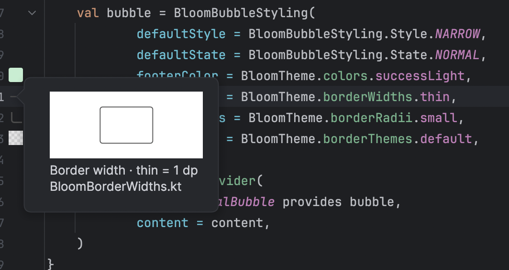
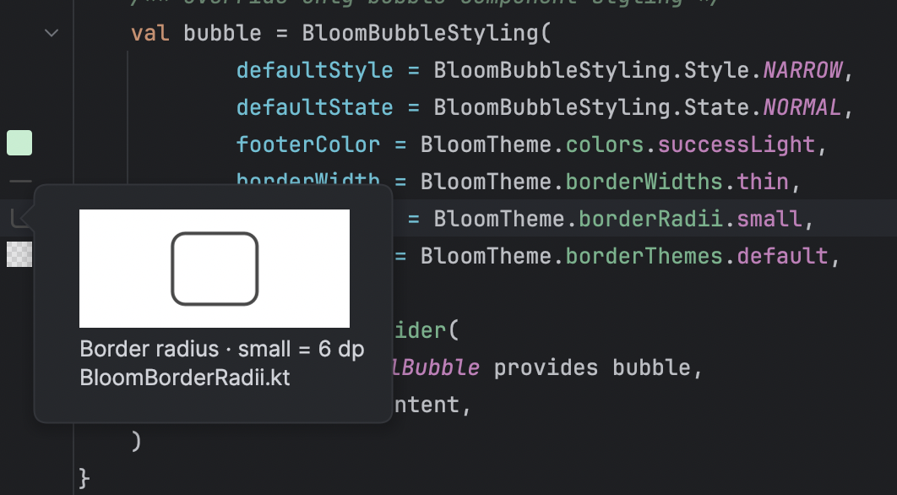
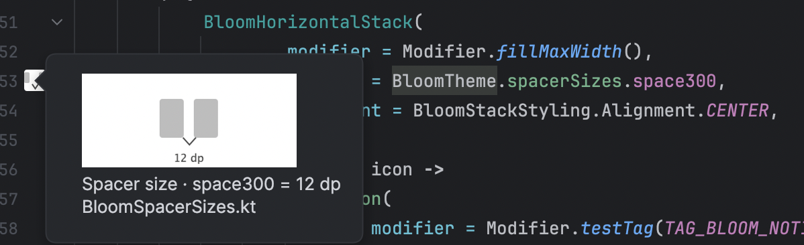

# Bloom Foundation Preview

[](https://github.com/vinted/bloom-android-studio-plugin/actions/workflows/plugin.yml)
[](https://plugins.jetbrains.com/plugin/34852-bloom-foundation-preview?noRedirect=true)
[](https://plugins.jetbrains.com/plugin/34852-bloom-foundation-preview?noRedirect=true)

Android Studio plugin for previews and resolved values of Bloom Design System foundations in the editor gutter.

## Installation

- [Open Bloom Foundation Preview in JetBrains Marketplace](https://plugins.jetbrains.com/plugin/34852-bloom-foundation-preview?noRedirect=true).
- In Android Studio, go to **Settings → Plugins → Marketplace**, search for **Bloom Foundation Preview**, then select **Install**.

## Previews

- Colors, dimensions, shadows, radii, widths, spacing, opacity, typography, and other Bloom foundations.
- Android `R.color`, `R.dimen`, and `R.drawable` references; XML resource references and aliases.
- Raster drawable thumbnails; vector/XML drawable markers.

## Screenshots

<table>
  <tr>
    <td></td>
    <td></td>
  </tr>
  <tr>
    <td></td>
    <td></td>
  </tr>
</table>

## Development

```shell
./gradlew runIde
./gradlew test buildPlugin
```

Plugin ZIP: `build/distributions/`.

## Release

- Set the version in `build.gradle.kts`.
- Push a matching `bloom-plugin-v<version>` tag to publish through GitHub Actions.
- GitHub repository secret: `JETBRAINS_MARKETPLACE_TOKEN`.

## License

MIT. See [LICENSE](LICENSE).
